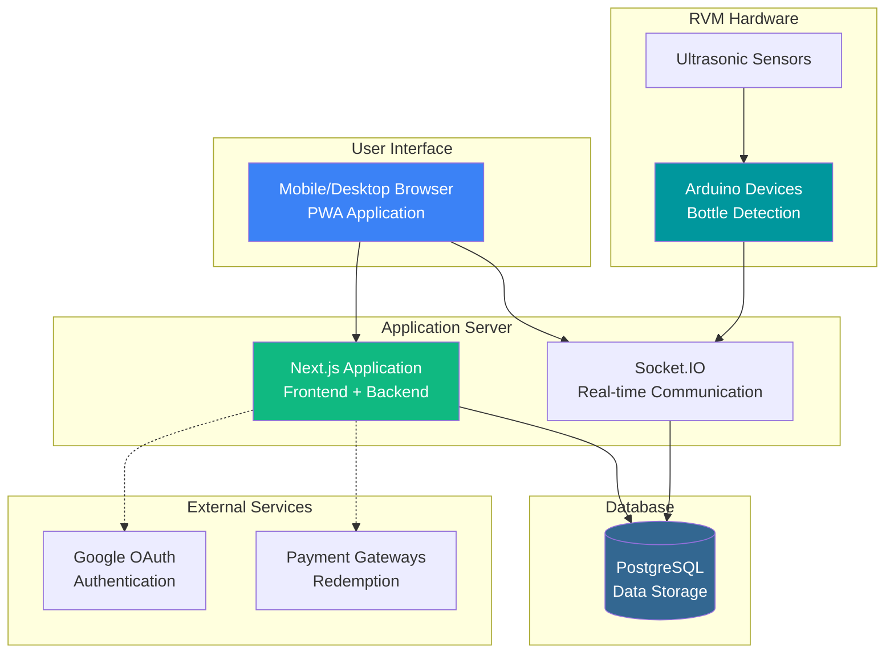
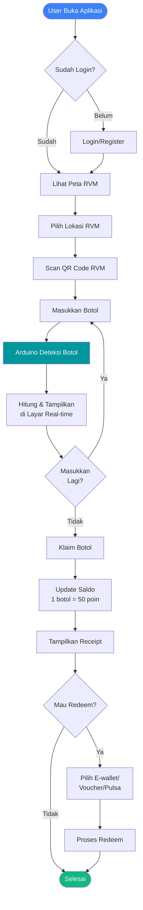
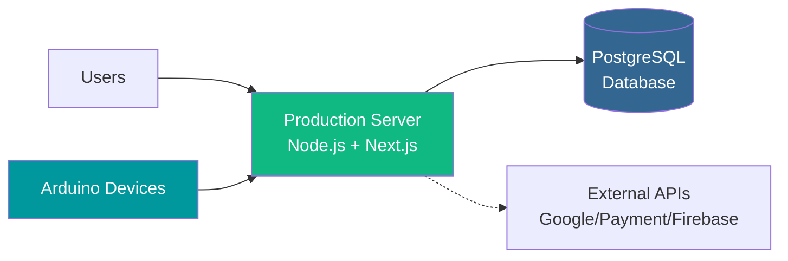

# Arsitektur Sistem RVM - Versi Sederhana

Dokumentasi arsitektur sistem RVM yang mudah dipahami dan dijelaskan.

---

## 1. Gambaran Umum Sistem



**Penjelasan Komponen:**

1. **User Interface**: Aplikasi web PWA yang bisa diakses dari browser atau diinstall
2. **Application Server**: Next.js menangani frontend dan backend API
3. **Socket.IO**: Real-time communication untuk deteksi botol langsung
4. **PostgreSQL**: Database untuk menyimpan semua data
5. **Arduino Devices**: Perangkat IoT di setiap mesin RVM untuk deteksi botol
6. **External Services**: Google OAuth untuk login, Payment Gateway untuk redeem

---

## 2. Alur Kerja Utama



---

## 3. Technology Stack

**Frontend:**
- Next.js 15 + React 19 (Web Application)
- Tailwind CSS (Styling)
- Leaflet (Maps untuk lokasi RVM)
- PWA (Installable app, offline support)

**Backend:**
- Node.js + Express (Server)
- Socket.IO (Real-time communication)
- Prisma (Database ORM)
- JWT (Authentication)

**Database:**
- PostgreSQL (Relational database)

**IoT:**
- Arduino ESP32 (Microcontroller)
- Ultrasonic Sensors (Deteksi botol)

**External Services:**
- Google OAuth (Login)
- Firebase (Notifications)
- Payment Gateways (BCA, GoPay, OVO, Dana)

---

## 4. Fitur Utama

1. **Autentikasi**: Login dengan email/password atau Google OAuth
2. **Peta Lokasi**: Tampilan peta interaktif untuk mencari RVM terdekat
3. **Scan QR**: Scan QR code di mesin RVM untuk memulai deposit
4. **Deteksi Real-time**: Botol terdeteksi langsung muncul di layar
5. **Sistem Poin**: 1 botol = 50 poin
6. **Redeem Rewards**: Tukar poin ke e-wallet, voucher, atau pulsa
7. **Riwayat Transaksi**: Lihat semua aktivitas deposit dan redeem
8. **Notifikasi**: Push notification untuk update penting

---

## 5. Deployment



**Infrastruktur:**
- Web Server: Node.js (Port 3000)
- Database: PostgreSQL (Cloud/On-premise)
- Arduino Devices: Terhubung via WiFi/Internet ke server
- External APIs: Google OAuth, Payment Gateways, Firebase

---

## 6. Data Flow Sederhana

**Proses Deposit Botol:**
```
User scan QR ? Arduino detect ? Socket.IO broadcast ? 
Database update ? UI update ? Points bertambah
```

**Proses Redeem:**
```
User pilih redeem ? Validasi poin ? Payment Gateway ? 
Database update ? Konfirmasi sukses
```

---

## Kesimpulan

Sistem RVM ini menggunakan arsitektur modern dengan:
- **Web application** yang responsif dan bisa diinstall (PWA)
- **Real-time communication** untuk pengalaman user yang smooth
- **IoT integration** dengan Arduino untuk hardware detection
- **Secure authentication** dengan JWT dan Google OAuth
- **Scalable database** dengan PostgreSQL

**Business Rule Utama:**
- 1 botol plastik = 50 poin
- Poin bisa diredeem ke berbagai metode pembayaran
- Semua transaksi tercatat untuk audit trail

---

*Untuk arsitektur detail lengkap, lihat [DIAGRAMS.md](./DIAGRAMS.md)*
*Untuk database schema, lihat [ERD.md](./ERD.md)*
