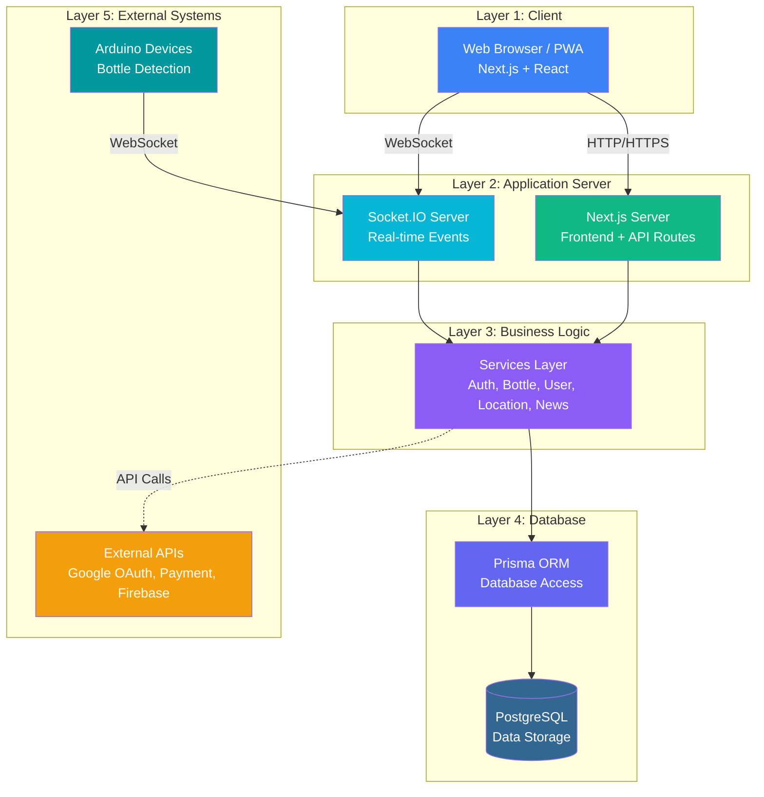
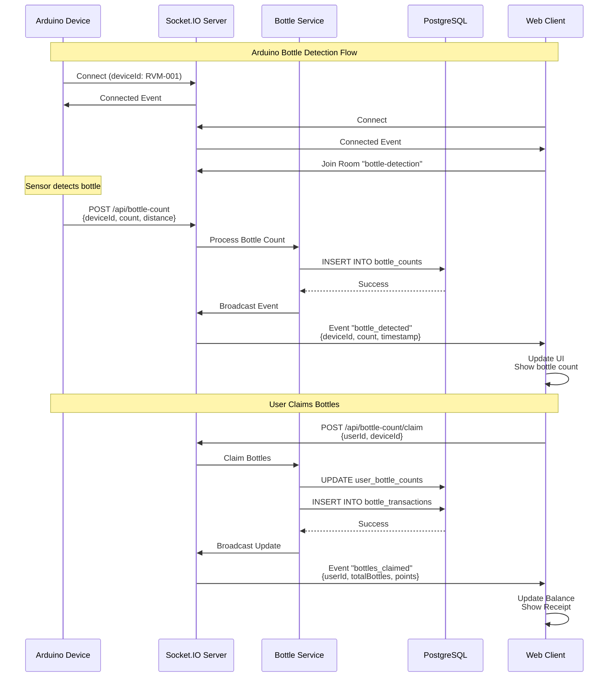
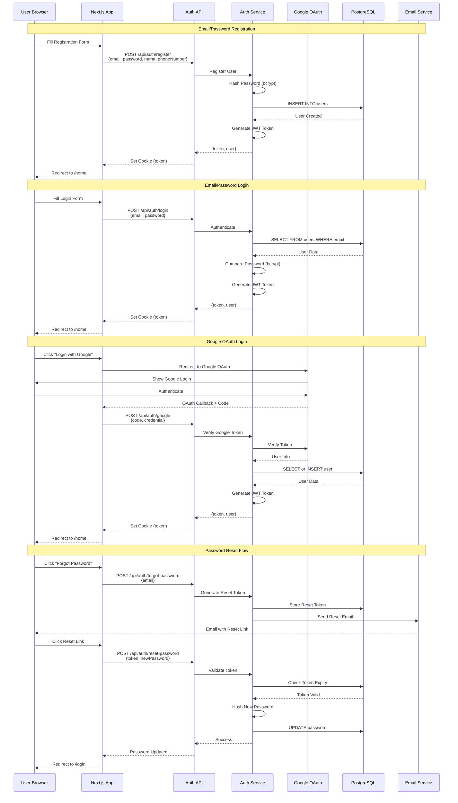
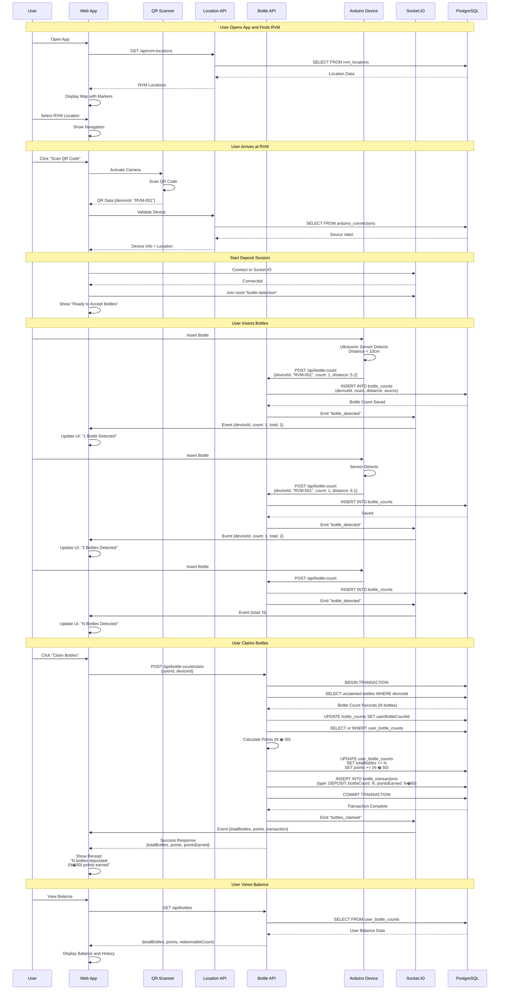
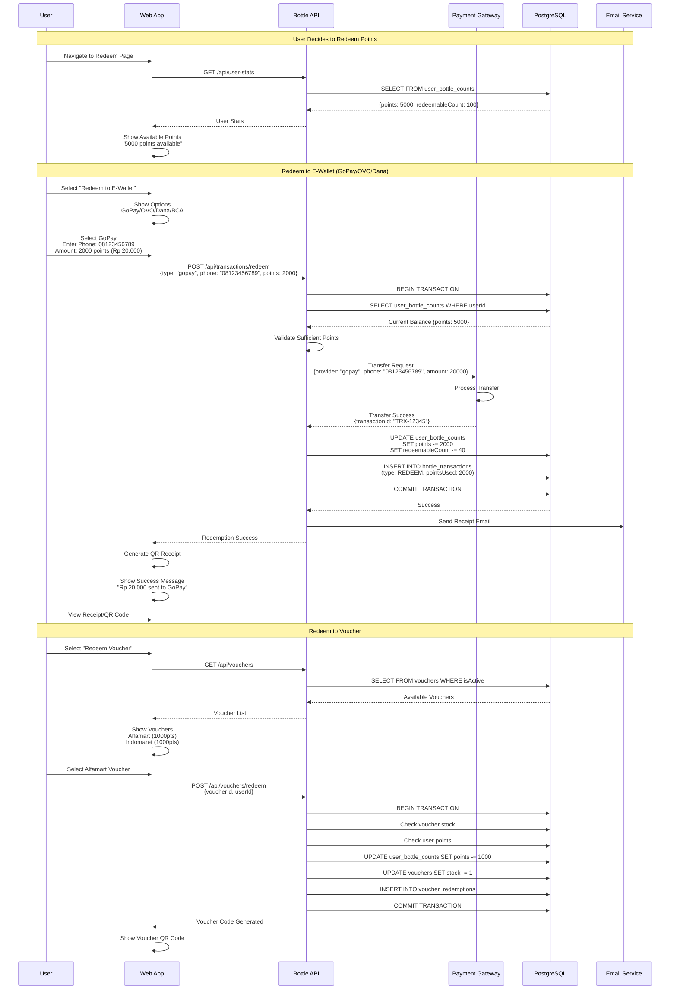
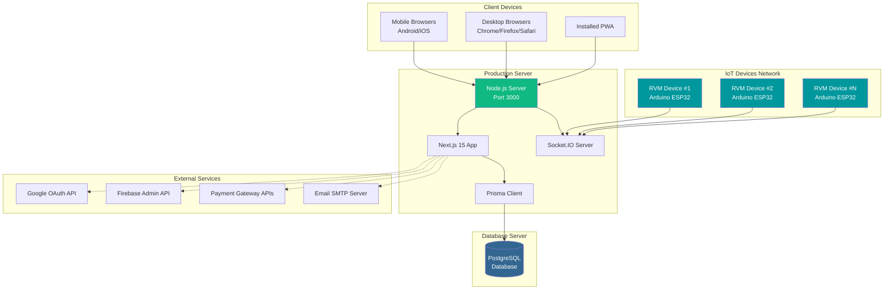

# Arsitektur Sistem RVM (Reverse Vending Machine)

Dokumentasi lengkap arsitektur sistem aplikasi web RVM dengan diagram Mermaid.

---

## 1. System Architecture Overview

```mermaid
graph TB
    subgraph "Client Layer - PWA"
        Browser[Web Browser]
        PWA[Service Worker<br/>Offline Support]
        ReactApp[React 19 Components]
        NextRouter[Next.js 15 Router]
        
        subgraph "UI Components"
            Maps[Leaflet Maps<br/>RVM Locations]
            QRScanner[QR Scanner<br/>html5-qrcode]
            QRGen[QR Generator<br/>qrcode.react]
            AuthUI[Auth Components<br/>Google OAuth Button]
        end
        
        subgraph "State Management"
            UserContext[User Context]
            LocationContext[Location Context]
            InstallContext[Install Context]
        end
    end
    
    subgraph "Server Layer - Node.js"
        subgraph "Next.js Server"
            NextServer[Next.js Server<br/>Port 3000]
            APIRoutes[API Routes<br/>/api/*]
        end
        
        subgraph "Custom Server"
            ExpressHTTP[HTTP Server<br/>Express + Next]
            SocketServer[Socket.IO Server<br/>Real-time Events]
        end
        
        subgraph "Middleware"
            AuthMiddleware[Auth Middleware<br/>JWT Validation]
            CORSMiddleware[CORS Handler]
        end
    end
    
    subgraph "Business Logic Layer"
        AuthService[Auth Service<br/>JWT + OAuth + bcrypt]
        BottleService[Bottle Service<br/>Deposit/Redeem Logic]
        UserService[User Service<br/>Profile Management]
        NewsService[News Service<br/>Content Management]
        LocationService[Location Service<br/>RVM + Arduino]
    end
    
    subgraph "Data Access Layer"
        PrismaClient[Prisma Client<br/>ORM]
        
        subgraph "Database Models"
            UserModel[User Model]
            BottleModel[Bottle Models]
            LocationModel[Location Models]
            VoucherModel[Voucher Models]
            AdminModel[Admin Models]
        end
    end
    
    subgraph "Database"
        PostgreSQL[(PostgreSQL<br/>Primary Database)]
    end
    
    subgraph "External Services"
        GoogleOAuth[Google OAuth 2.0<br/>Authentication]
        Firebase[Firebase Admin<br/>Cloud Messaging]
        PaymentGW[Payment Gateways<br/>BCA/GoPay/OVO/Dana]
        EmailService[Nodemailer<br/>Email Service]
    end
    
    subgraph "IoT Layer"
        Arduino1[Arduino Device 1<br/>deviceId: RVM-001]
        Arduino2[Arduino Device 2<br/>deviceId: RVM-002]
        ArduinoN[Arduino Device N<br/>deviceId: RVM-N]
        
        Sensors[Ultrasonic Sensors<br/>Distance Detection]
    end
    
    Browser --> ReactApp
    ReactApp --> NextRouter
    ReactApp --> Maps
    ReactApp --> QRScanner
    ReactApp --> QRGen
    ReactApp --> AuthUI
    ReactApp --> UserContext
    ReactApp --> LocationContext
    ReactApp --> InstallContext
    ReactApp --> PWA
    
    ReactApp --> APIRoutes
    ReactApp --> SocketServer
    
    NextRouter --> NextServer
    APIRoutes --> ExpressHTTP
    ExpressHTTP --> AuthMiddleware
    ExpressHTTP --> CORSMiddleware
    
    APIRoutes --> AuthService
    APIRoutes --> BottleService
    APIRoutes --> UserService
    APIRoutes --> NewsService
    APIRoutes --> LocationService
    
    AuthService --> PrismaClient
    BottleService --> PrismaClient
    UserService --> PrismaClient
    NewsService --> PrismaClient
    LocationService --> PrismaClient
    
    PrismaClient --> UserModel
    PrismaClient --> BottleModel
    PrismaClient --> LocationModel
    PrismaClient --> VoucherModel
    PrismaClient --> AdminModel
    
    UserModel --> PostgreSQL
    BottleModel --> PostgreSQL
    LocationModel --> PostgreSQL
    VoucherModel --> PostgreSQL
    AdminModel --> PostgreSQL
    
    AuthService -.-> GoogleOAuth
    AuthService -.-> EmailService
    LocationService -.-> Firebase
    BottleService -.-> PaymentGW
    
    Arduino1 --> SocketServer
    Arduino2 --> SocketServer
    ArduinoN --> SocketServer
    Sensors --> Arduino1
    Sensors --> Arduino2
    Sensors --> ArduinoN
    
    SocketServer --> BottleService
    SocketServer --> LocationService
    
    style Browser fill:#3b82f6,color:#fff
    style PostgreSQL fill:#336791,color:#fff
    style Arduino1 fill:#00979d,color:#fff
    style Arduino2 fill:#00979d,color:#fff
    style ArduinoN fill:#00979d,color:#fff
    style GoogleOAuth fill:#4285f4,color:#fff
    style Firebase fill:#ffca28,color:#000
    style SocketServer fill:#10b981,color:#fff
```



---

## 2. System Architecture Overview - Simplified

Versi sederhana dari arsitektur sistem yang mudah dipahami dan dijelaskan.



**Penjelasan Singkat:**

- **Layer 1 (Client)**: Aplikasi web yang diakses user melalui browser atau diinstall sebagai PWA
- **Layer 2 (Application Server)**: Next.js menangani web pages dan API, Socket.IO untuk real-time communication
- **Layer 3 (Business Logic)**: Services yang menangani logika bisnis (autentikasi, bottle management, dll)
- **Layer 4 (Database)**: PostgreSQL untuk data storage, diakses melalui Prisma ORM
- **Layer 5 (External Systems)**: Arduino devices untuk deteksi botol, dan external APIs untuk OAuth/Payment

**Alur Data Utama:**
1. User → Web Server (request/response HTTP)
2. Arduino → Socket.IO → Services → Database (bottle detection real-time)
3. Services → External APIs (authentication, payment processing)

---

## 3. Technology Stack

```mermaid
graph LR
    subgraph "Frontend Stack"
        FE1[Next.js 15.3.0<br/>React 19.0.0]
        FE2[Tailwind CSS 3.4.1<br/>PostCSS 8]
        FE3[TypeScript 5.7.2]
        FE4[Leaflet 1.9.4<br/>react-leaflet 5.0.0]
        FE5[html5-qrcode 2.3.8<br/>qrcode.react 4.2.0]
        FE6[next-pwa 5.6.0<br/>PWA Support]
    end
    
    subgraph "Backend Stack"
        BE1[Node.js<br/>Express 5.1.0]
        BE2[Socket.IO 4.8.1<br/>Real-time]
        BE3[Prisma 6.12.0<br/>ORM]
        BE4[jsonwebtoken 9.0.2<br/>JWT Auth]
        BE5[bcryptjs 3.0.2<br/>Password Hash]
        BE6[@react-oauth/google<br/>OAuth 0.13.5]
    end
    
    subgraph "Database"
        DB1[(PostgreSQL<br/>Relational DB)]
    end
    
    subgraph "External APIs"
        EXT1[Google OAuth 2.0]
        EXT2[Firebase Admin 13.7.0<br/>FCM]
        EXT3[Nodemailer 8.0.4<br/>Email]
        EXT4[Payment APIs<br/>BCA/GoPay/etc]
    end
    
    subgraph "IoT"
        IOT1[Arduino Devices<br/>HTTP/WebSocket]
        IOT2[Ultrasonic Sensors<br/>HC-SR04]
    end
    
    FE1 --> BE1
    FE1 --> BE2
    BE1 --> BE3
    BE3 --> DB1
    BE1 --> BE4
    BE1 --> BE5
    FE1 --> BE6
    BE6 -.-> EXT1
    BE1 -.-> EXT2
    BE1 -.-> EXT3
    BE1 -.-> EXT4
    IOT1 --> BE2
    IOT2 --> IOT1
```

---

## 4. API Routes Structure

```mermaid
graph TB
    subgraph "Authentication APIs"
        AUTH1[POST /api/auth/register]
        AUTH2[POST /api/auth/login]
        AUTH3[POST /api/auth/logout]
        AUTH4[POST /api/auth/google]
        AUTH5[POST /api/auth/forgot-password]
        AUTH6[POST /api/auth/reset-password]
        AUTH7[GET /api/auth/token]
    end
    
    subgraph "User Management APIs"
        USER1[GET /api/profile]
        USER2[GET /api/profile-simple]
        USER3[PUT /api/user/profile]
        USER4[GET /api/user-stats]
        USER5[GET /api/users]
    end
    
    subgraph "Bottle Management APIs"
        BOTTLE1[GET /api/bottles]
        BOTTLE2[POST /api/bottle-count]
        BOTTLE3[GET /api/bottle-count/arduino]
        BOTTLE4[POST /api/bottle-count/claim]
        BOTTLE5[POST /api/bottle-count/user-mapping]
        BOTTLE6[GET /api/bottles/history]
        BOTTLE7[GET /api/bottles/statistics]
    end
    
    subgraph "Location APIs"
        LOC1[GET /api/rvm-locations]
        LOC2[GET /api/detail-locations]
        LOC3[DELETE /api/rvm-locations/[id]/delete]
        LOC4[PUT /api/rvm-locations/[id]/edit]
    end
    
    subgraph "Transaction APIs"
        TRANS1[GET /api/transactions/history]
    end
    
    subgraph "News APIs"
        NEWS1[GET /api/news]
        NEWS2[GET /api/news/latest]
        NEWS3[POST /api/news-publish]
        NEWS4[GET /api/news-debug]
    end
    
    subgraph "Diagnostic & Health APIs"
        DIAG1[GET /api/health]
        DIAG2[GET /api/diagnostic]
        DIAG3[GET /api/db-test]
        DIAG4[GET /api/test-prisma]
        DIAG5[GET /api/setup-check]
        DIAG6[GET /api/schema-check]
        DIAG7[GET /api/debug-rvm]
        DIAG8[GET /api/test]
    end
    
    subgraph "Socket.IO"
        SOCKET1[WS /api/socket]
    end
    
    AUTH1 --> AuthService
    AUTH2 --> AuthService
    AUTH3 --> AuthService
    AUTH4 --> AuthService
    AUTH5 --> AuthService
    AUTH6 --> AuthService
    AUTH7 --> AuthService
    
    USER1 --> UserService
    USER2 --> UserService
    USER3 --> UserService
    USER4 --> UserService
    USER5 --> UserService
    
    BOTTLE1 --> BottleService
    BOTTLE2 --> BottleService
    BOTTLE3 --> BottleService
    BOTTLE4 --> BottleService
    BOTTLE5 --> BottleService
    BOTTLE6 --> BottleService
    BOTTLE7 --> BottleService
    
    LOC1 --> LocationService
    LOC2 --> LocationService
    LOC3 --> LocationService
    LOC4 --> LocationService
    
    TRANS1 --> BottleService
    
    NEWS1 --> NewsService
    NEWS2 --> NewsService
    NEWS3 --> NewsService
    NEWS4 --> NewsService
    
    SOCKET1 --> SocketServer
    
    style AuthService fill:#3b82f6,color:#fff
    style BottleService fill:#10b981,color:#fff
    style UserService fill:#8b5cf6,color:#fff
    style LocationService fill:#f59e0b,color:#fff
    style NewsService fill:#ef4444,color:#fff
    style SocketServer fill:#06b6d4,color:#fff
```

---

## 5. Real-time Communication Flow (Socket.IO)



---

## 6. Authentication Flow



---

## 7. Bottle Deposit Sequence Diagram



---

## 8. Redemption Flow Diagram



---

## 9. Component Architecture

```mermaid
graph TB
    subgraph "Pages - Next.js App Router"
        P1[/splash]
        P2[/onboarding]
        P3[/login]
        P4[/registration]
        P5[/home]
        P6[/lokasi - RVM Locations]
        P7[/qr - QR Scanner]
        P8[/bottlein - Bottle Deposit]
        P9[/profil - User Profile]
        P10[/aktifitas - Activity History]
        P11[/reedem-decision - Redeem Choice]
        P12[/reedem-gopay, /reedem-bca, /reedem-voucher]
        P13[/receipt-qr - Receipt Display]
        P14[/news - News Articles]
    end
    
    subgraph "Components"
        subgraph "UI Components"
            C1[Navbar]
            C2[Modal]
            C3[AuthDialog]
            C4[Carousel]
            C5[BottleCountDisplay]
            C6[InstallButton]
            C7[GoogleLoginButton]
        end
        
        subgraph "Feature Components"
            C8[LeafletMap]
            C9[OnboardingTour]
            C10[DeviceGuard]
        end
        
        subgraph "Container Components"
            C11[ForgotPassword Container]
            C12[NewPassword Container]
            C13[OptionItems Container]
            C14[ReceiptRedeemQR Container]
            C15[Maps Container]
            C16[Terms Container]
        end
    end
    
    subgraph "Contexts - State Management"
        CTX1[UserContextNew]
        CTX2[LocationContext]
        CTX3[InstallContext]
    end
    
    subgraph "Services"
        S1[auth-service.js]
        S2[bottle-service.js]
        S3[user-service.js]
        S4[location-service.js]
        S5[news-service.js]
    end
    
    subgraph "Hooks"
        H1[use-fetch.js]
        H2[use-socket-clients.js]
    end
    
    P5 --> C1
    P5 --> C8
    P6 --> C8
    P7 --> C1
    P8 --> C5
    P9 --> C1
    
    P3 --> C7
    P3 --> C3
    
    P5 --> CTX1
    P6 --> CTX2
    All --> CTX3
    
    CTX1 --> S1
    CTX1 --> S3
    CTX2 --> S4
    
    S1 --> H1
    S2 --> H1
    S2 --> H2
    S3 --> H1
    S4 --> H1
    S5 --> H1
```

---

## 10. Deployment Architecture



---

## 11. Database Schema Reference

Untuk detail lengkap Entity Relationship Diagram (ERD), lihat file [ERD.md](./ERD.md).

**Entitas Utama:**
- User - Data pengguna aplikasi
- UserBottleCount - Saldo botol dan poin user
- BottleTransaction - Riwayat transaksi deposit/redeem
- BottleCount - Raw data deteksi dari Arduino
- ArduinoConnection - Status koneksi perangkat Arduino
- RvmLocation - Lokasi mesin RVM
- Voucher & VoucherRedemption - Sistem voucher reward
- News - Konten berita dan artikel
- Admin & AuditLog - Manajemen admin dan audit trail
- SystemConfig - Konfigurasi sistem

**Business Rules:**
- 1 botol = 50 poin
- Points dapat ditukar ke e-wallet, voucher, atau pulsa
- Setiap transaksi tercatat di audit log
- Arduino devices dapat beroperasi dengan atau tanpa user login (anonymous detection)

---

## Rangkuman Arsitektur

### Arsitektur Berlapis (Layered Architecture)

Sistem RVM menggunakan arsitektur berlapis dengan pemisahan yang jelas:

1. **Client Layer (PWA)**: Next.js 15 + React 19 dengan PWA support untuk offline capability
2. **API Layer**: Next.js API Routes + Custom Express Server + Socket.IO untuk real-time
3. **Business Logic Layer**: Services (Auth, Bottle, User, Location, News)
4. **Data Access Layer**: Prisma ORM dengan type-safe queries
5. **Database Layer**: PostgreSQL untuk data persistence
6. **IoT Layer**: Arduino devices dengan ultrasonic sensors

### Pola Komunikasi

**Synchronous (HTTP/REST):**
- Client ? API Routes untuk operasi CRUD standar
- Autentikasi menggunakan JWT tokens di cookies
- RESTful endpoints dengan standard HTTP methods

**Asynchronous (WebSocket):**
- Arduino ? Socket.IO untuk bottle detection real-time
- Client ? Socket.IO untuk live updates di UI
- Event-driven architecture untuk responsiveness

### Keputusan Teknis Utama

**1. Next.js 15 dengan App Router**
- SSR dan SSG untuk performa optimal
- API Routes terintegrasi untuk backend
- File-based routing untuk developer experience

**2. Prisma ORM**
- Type-safe database queries
- Migration management yang robust
- Auto-generated client untuk TypeScript

**3. Socket.IO untuk Real-time**
- Bi-directional communication dengan Arduino
- Room-based broadcasting untuk efficiency
- Automatic reconnection handling

**4. PostgreSQL Database**
- ACID compliance untuk transaction integrity
- JSON support untuk flexible schema (position, images)
- Robust indexing untuk query performance

**5. PWA Implementation**
- Offline-first strategy dengan service workers
- App-like experience di mobile devices
- Push notifications via Firebase

### Alur Data Utama

```
User deposits bottle ? Arduino detects ? Socket.IO broadcasts ? 
API processes ? Database updates ? Client UI updates ? Receipt generated
```

**Karakteristik:**
- Real-time updates (< 1 second latency)
- Transaction atomicity (all-or-nothing)
- Audit trail lengkap
- Scalable untuk multiple RVM locations

### Skalabilitas & Performa

**Current Capacity:**
- Multiple concurrent users per RVM device
- Real-time broadcasting ke semua connected clients
- Database optimized dengan indexes dan transactions

**Scaling Strategy:**
- Horizontal: Tambah Arduino devices per location
- Vertical: Database connection pooling via Prisma
- Caching: Client-side state management dengan React Context

---

## Teknologi Stack Detail

| Kategori | Teknologi | Versi | Fungsi |
|----------|-----------|-------|--------|
| **Frontend** | Next.js | 15.3.0 | React framework dengan SSR |
| | React | 19.0.0 | UI library |
| | Tailwind CSS | 3.4.1 | Styling framework |
| | TypeScript | 5.7.2 | Type safety |
| | Leaflet | 1.9.4 | Maps & geolocation |
| **Backend** | Node.js | Latest | Runtime environment |
| | Express | 5.1.0 | HTTP server |
| | Socket.IO | 4.8.1 | WebSocket server |
| | Prisma | 6.12.0 | Database ORM |
| **Auth** | jsonwebtoken | 9.0.2 | JWT authentication |
| | bcryptjs | 3.0.2 | Password hashing |
| | @react-oauth/google | 0.13.5 | Google OAuth |
| **Database** | PostgreSQL | Latest | Relational database |
| **External** | Firebase Admin | 13.7.0 | Push notifications |
| | Nodemailer | 8.0.4 | Email service |
| **IoT** | Arduino ESP32 | - | Microcontroller |
| | HC-SR04 | - | Ultrasonic sensor |

---

*Dokumentasi terakhir diperbarui: Juni 2026*
*Untuk detail database schema, lihat [ERD.md](./ERD.md)*
*Untuk deployment dan setup, lihat [README.md](./README.md)*
