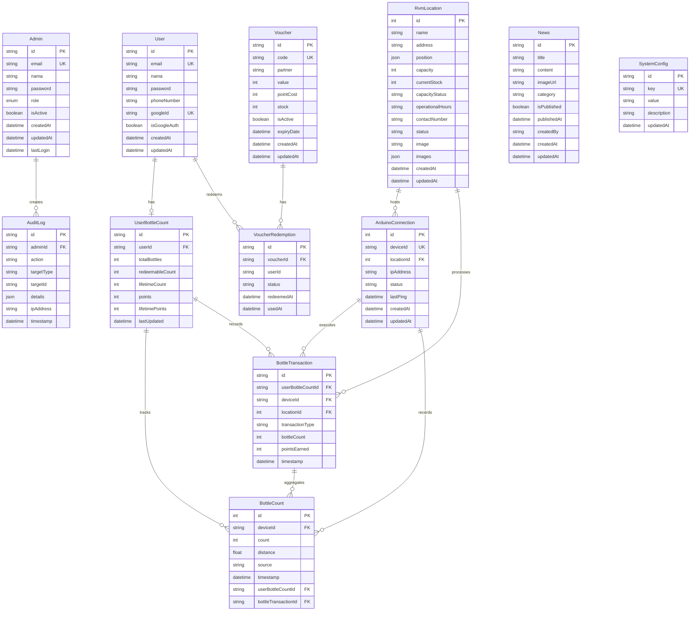

# Database Entity Relationship Diagram

## Entity Descriptions

### User Management
- **User**: End users who use the RVM system for bottle recycling
- **Admin**: System administrators with different roles (SUPER_ADMIN, ADMIN, OPERATOR, CONTENT_MANAGER)

### Bottle Tracking
- **UserBottleCount**: Aggregate bottle and points tracking for each user
- **BottleTransaction**: Individual transaction records (deposit, redeem, adjustment)
- **BottleCount**: Raw bottle count data from devices

### Device & Location
- **ArduinoConnection**: Arduino device connection status and management
- **RvmLocation**: Physical locations of RVM machines

### Voucher System
- **Voucher**: Available vouchers that can be redeemed with points
- **VoucherRedemption**: Records of voucher redemptions by users

### System
- **AuditLog**: Admin action audit trail
- **News**: News and announcements for users
- **SystemConfig**: System-wide configuration key-value pairs

## Relationship Details

1. **User ↔ UserBottleCount** (1:1)
   - One user has one bottle count record
   - Cascade delete enabled

2. **UserBottleCount ↔ BottleCount** (1:N)
   - One user bottle count tracks many individual bottle counts
   - Cascade delete enabled

3. **UserBottleCount ↔ BottleTransaction** (1:N)
   - One user bottle count has many transactions
   - Cascade delete enabled

4. **Admin ↔ AuditLog** (1:N)
   - One admin creates many audit log entries
   - Cascade delete enabled

5. **Voucher ↔ VoucherRedemption** (1:N)
   - One voucher can be redeemed multiple times
   - Cascade delete enabled

6. **RvmLocation ↔ ArduinoConnection** (1:N)
   - One RVM location can host multiple Arduino devices
   - locationId is optional (nullable) - devices may exist without assigned locations
   - Allows tracking which Arduino devices are deployed at each physical location

7. **User ↔ VoucherRedemption** (1:N)
   - One user can redeem multiple vouchers
   - Tracks voucher redemption history per user
   - Cascade delete enabled

8. **ArduinoConnection ↔ BottleTransaction** (1:N)
   - One Arduino device can process many transactions
   - deviceId in BottleTransaction references unique deviceId in ArduinoConnection
   - Allows tracking which specific device processed each transaction
   - SetNull on delete (preserves transaction history even if device is removed)

9. **ArduinoConnection ↔ BottleCount** (1:N)
   - One Arduino device records many bottle counts
   - deviceId in BottleCount references unique deviceId in ArduinoConnection
   - Tracks raw sensor data from each device
   - Cascade delete enabled

10. **BottleTransaction ↔ BottleCount** (1:N)
    - One BottleTransaction aggregates many raw BottleCount records
    - bottleTransactionId in BottleCount references BottleTransaction
    - Example: User deposits 5 bottles → 5 BottleCount records → 1 BottleTransaction
    - Links business transaction to individual sensor readings for complete audit trail
    - SetNull on delete (preserves raw sensor data even if transaction is removed)

11. **RvmLocation ↔ BottleTransaction** (1:N)
    - One location processes many transactions
    - locationId in BottleTransaction references RvmLocation
    - Direct relationship for efficient location-based queries and reporting
    - SetNull on delete (preserves transaction history even if location is removed)

## Enumerations

### AdminRole
- SUPER_ADMIN
- ADMIN
- OPERATOR
- CONTENT_MANAGER

### BottleTransactionType
- DEPOSIT
- REDEEM
- ADJUSTMENT
